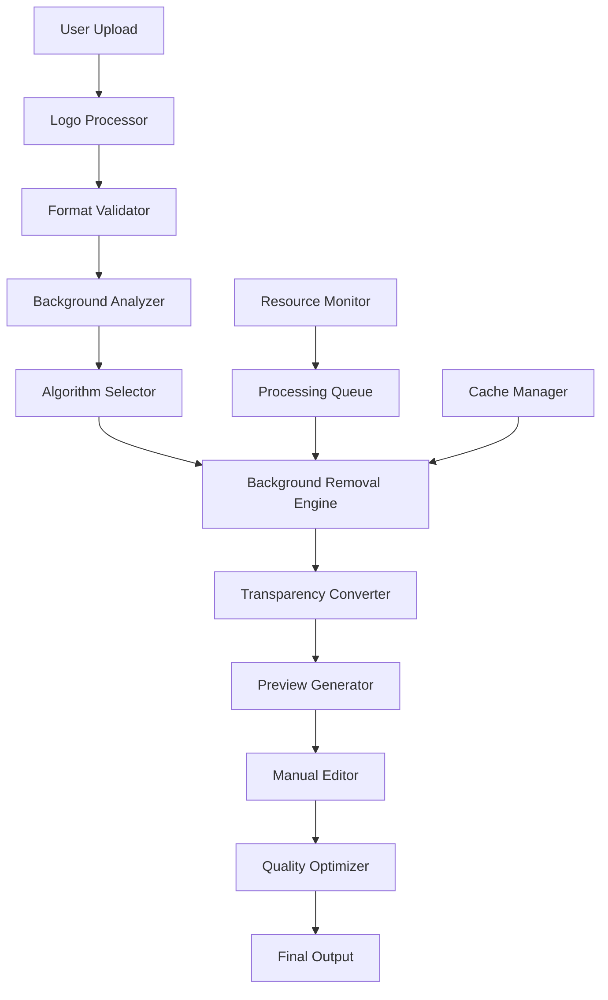
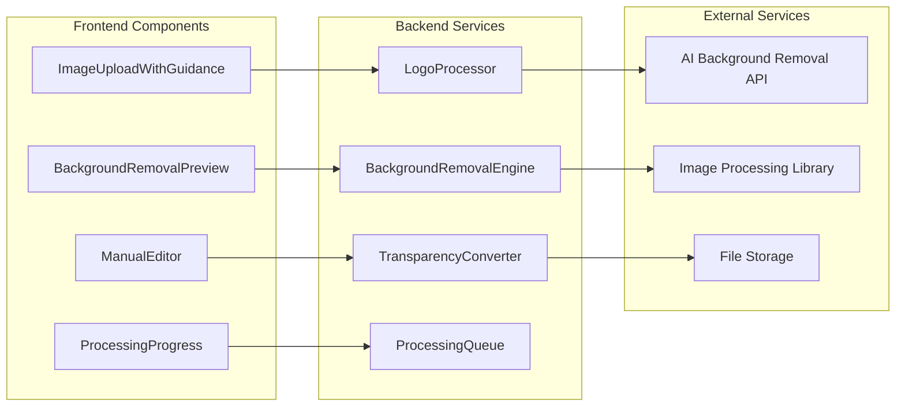

# Design Document: Automatic Logo Background Removal

## Overview

The Automatic Logo Background Removal feature enables users to upload logos in any format (particularly JPG/JPEG) and automatically convert them to PNG format with transparent backgrounds. This eliminates the need for users to manually create transparent logos using design software, making professional branding accessible to all users.

The system uses multiple background removal algorithms including AI-based processing, color-based detection, and edge detection to handle various logo types. It provides real-time previews, manual fine-tuning tools, and seamless integration with the existing branding system.

## Architecture

### High-Level Architecture



### Component Architecture



## Components and Interfaces

### 1. Logo Processor Service

**Purpose**: Orchestrates the entire background removal workflow

**Interface**:
```typescript
interface LogoProcessor {
  processLogo(file: File, options: ProcessingOptions): Promise<ProcessingResult>
  getProcessingStatus(jobId: string): Promise<ProcessingStatus>
  cancelProcessing(jobId: string): Promise<void>
}

interface ProcessingOptions {
  algorithm?: 'auto' | 'ai' | 'color' | 'edge'
  quality?: 'high' | 'medium' | 'low'
  generateSizes?: boolean
  preserveOriginal?: boolean
}

interface ProcessingResult {
  success: boolean
  originalUrl: string
  processedUrl?: string
  previewUrls: {
    lightBackground: string
    darkBackground: string
  }
  metadata: {
    algorithm: string
    processingTime: number
    confidence: number
  }
  error?: string
}
```

### 2. Background Removal Engine

**Purpose**: Handles different background removal algorithms

**Interface**:
```typescript
interface BackgroundRemovalEngine {
  analyzeImage(imageData: ImageData): Promise<ImageAnalysis>
  removeBackground(imageData: ImageData, algorithm: Algorithm): Promise<ProcessedImage>
  selectOptimalAlgorithm(analysis: ImageAnalysis): Algorithm
}

interface ImageAnalysis {
  hasTransparency: boolean
  backgroundType: 'solid' | 'gradient' | 'complex' | 'transparent'
  dominantColors: Color[]
  edgeComplexity: number
  recommendedAlgorithm: Algorithm
}

type Algorithm = 'ai' | 'color-threshold' | 'edge-detection' | 'magic-wand'
```

### 3. AI Background Removal Service

**Purpose**: Integrates with AI-based background removal APIs

**Interface**:
```typescript
interface AIBackgroundRemoval {
  isAvailable(): Promise<boolean>
  removeBackground(imageBuffer: Buffer): Promise<Buffer>
  getConfidenceScore(result: Buffer): Promise<number>
}

// Implementation options:
// - Remove.bg API
// - Clipdrop API  
// - Local AI model (TensorFlow.js)
// - Custom trained model
```

### 4. Color-Based Background Removal

**Purpose**: Removes backgrounds based on color similarity

**Interface**:
```typescript
interface ColorBasedRemoval {
  detectBackgroundColor(imageData: ImageData): Color
  removeByColorThreshold(imageData: ImageData, threshold: number): ImageData
  floodFill(imageData: ImageData, startPoint: Point, tolerance: number): ImageData
}
```

### 5. Edge Detection Algorithm

**Purpose**: Uses edge detection for complex background removal

**Interface**:
```typescript
interface EdgeDetectionRemoval {
  detectEdges(imageData: ImageData): EdgeMap
  createMask(edges: EdgeMap): AlphaMask
  applyMask(imageData: ImageData, mask: AlphaMask): ImageData
}
```

### 6. Manual Editor Component

**Purpose**: Provides manual editing tools for fine-tuning

**Interface**:
```typescript
interface ManualEditor {
  initializeEditor(imageData: ImageData): void
  addEraser(size: number, hardness: number): Tool
  addRestore(size: number): Tool
  addZoom(level: number): void
  getEditedImage(): ImageData
  resetToOriginal(): void
}
```

### 7. Processing Queue

**Purpose**: Manages asynchronous processing with resource limits

**Interface**:
```typescript
interface ProcessingQueue {
  addJob(job: ProcessingJob): Promise<string>
  getJobStatus(jobId: string): ProcessingStatus
  cancelJob(jobId: string): Promise<void>
  setMaxConcurrentJobs(limit: number): void
}

interface ProcessingJob {
  id: string
  imageData: ImageData
  options: ProcessingOptions
  priority: number
  createdAt: Date
}

interface ProcessingStatus {
  status: 'queued' | 'processing' | 'completed' | 'failed' | 'cancelled'
  progress: number
  stage: string
  estimatedTimeRemaining?: number
  error?: string
}
```

## Data Models

### Processing Job Model
```typescript
interface ProcessingJobModel {
  id: string
  userId: string
  originalImageUrl: string
  processedImageUrl?: string
  status: ProcessingStatus
  algorithm: Algorithm
  options: ProcessingOptions
  metadata: {
    fileSize: number
    dimensions: { width: number; height: number }
    format: string
    processingTime?: number
    confidence?: number
  }
  createdAt: Date
  completedAt?: Date
}
```

### Cache Model
```typescript
interface ProcessingCacheModel {
  imageHash: string
  processedImageUrl: string
  algorithm: Algorithm
  options: ProcessingOptions
  createdAt: Date
  accessCount: number
  lastAccessed: Date
}
```

## Correctness Properties

*A property is a characteristic or behavior that should hold true across all valid executions of a system-essentially, a formal statement about what the system should do. Properties serve as the bridge between human-readable specifications and machine-verifiable correctness guarantees.*

### Property 1: Background Detection Accuracy
*For any* uploaded JPG/JPEG image with a detectable background, the Logo_Processor should successfully identify background areas with reasonable accuracy
**Validates: Requirements 1.1**

### Property 2: Format Conversion Consistency  
*For any* successfully processed image, the output should be PNG format with proper transparency applied
**Validates: Requirements 1.3**

### Property 3: Algorithm Fallback Chain
*For any* image processing request, if the primary algorithm fails, the system should attempt fallback algorithms in the correct order (AI → color-based → edge detection)
**Validates: Requirements 2.2, 2.3, 2.4**

### Property 4: Processing Queue Concurrency Limits
*For any* number of concurrent processing requests, the system should never exceed the configured maximum concurrent operations limit
**Validates: Requirements 9.1**

### Property 5: Original Image Preservation on Failure
*For any* processing operation that fails, the system should preserve and return the original uploaded image unchanged
**Validates: Requirements 7.1, 7.2**

### Property 6: Transparency Preservation for PNG Inputs
*For any* PNG image uploaded with existing transparency, the system should preserve the original transparency without modification
**Validates: Requirements 8.5**

### Property 7: Real-time Preview Updates
*For any* manual editing operation, the preview should update immediately to reflect the changes
**Validates: Requirements 4.4, 8.3**

### Property 8: Resource Cleanup
*For any* completed or failed processing job, all temporary files and resources should be properly cleaned up
**Validates: Requirements 9.5**

### Property 9: Progress Reporting Accuracy
*For any* processing operation, the progress indicator should accurately reflect the current processing stage and estimated completion time
**Validates: Requirements 5.2, 5.3**

### Property 10: Cache Hit Consistency
*For any* identical image processed with identical options, the system should return cached results instead of reprocessing
**Validates: Requirements 9.3**

### Property 11: Quality Preservation
*For any* processed image, the output quality should meet or exceed the minimum quality threshold while being optimized for web use
**Validates: Requirements 6.3**

### Property 12: Error Message Clarity
*For any* processing failure, the system should provide specific, actionable error messages with suggested solutions
**Validates: Requirements 7.4, 10.4**

## Error Handling

### Error Categories

1. **Input Validation Errors**
   - Unsupported file formats
   - File size limits exceeded
   - Corrupted image files
   - Invalid image dimensions

2. **Processing Errors**
   - AI service unavailable
   - Algorithm processing failures
   - Memory allocation failures
   - Timeout errors

3. **Resource Errors**
   - Storage space insufficient
   - Processing queue full
   - System resource limits exceeded
   - Network connectivity issues

4. **Integration Errors**
   - External API failures
   - Database connection issues
   - File system errors
   - Cache service failures

### Error Recovery Strategies

```typescript
interface ErrorRecoveryStrategy {
  handleInputValidationError(error: ValidationError): RecoveryAction
  handleProcessingError(error: ProcessingError): RecoveryAction
  handleResourceError(error: ResourceError): RecoveryAction
  handleIntegrationError(error: IntegrationError): RecoveryAction
}

type RecoveryAction = 
  | { type: 'retry', maxAttempts: number, backoffMs: number }
  | { type: 'fallback', algorithm: Algorithm }
  | { type: 'useOriginal', preserveUpload: boolean }
  | { type: 'queueForLater', priority: number }
  | { type: 'fail', userMessage: string, suggestedActions: string[] }
```

## Testing Strategy

### Unit Testing
- **Algorithm Testing**: Test each background removal algorithm with known input/output pairs
- **Component Testing**: Test individual components (LogoProcessor, BackgroundRemovalEngine, etc.)
- **Error Handling**: Test error scenarios and recovery mechanisms
- **Cache Logic**: Test cache hit/miss scenarios and cleanup

### Integration Testing
- **End-to-End Workflow**: Test complete processing pipeline from upload to final output
- **External Service Integration**: Test AI API integration with mock services
- **Database Integration**: Test job persistence and status tracking
- **File Storage Integration**: Test image upload, processing, and retrieval

### Property-Based Testing
Each correctness property will be implemented as a property-based test:

- **Minimum 100 iterations** per property test
- **Random input generation** for various image types, sizes, and formats
- **Comprehensive edge case coverage** including malformed inputs
- **Performance benchmarking** for processing time limits
- **Resource usage monitoring** for memory and storage limits

### Performance Testing
- **Load Testing**: Test system behavior under high concurrent processing loads
- **Memory Testing**: Verify memory usage stays within acceptable limits for large images
- **Processing Time**: Ensure processing completes within reasonable time limits
- **Cache Performance**: Test cache hit rates and storage efficiency

### User Acceptance Testing
- **Usability Testing**: Test the manual editor and preview interfaces
- **Quality Assessment**: Evaluate background removal quality across different logo types
- **Error Message Testing**: Verify error messages are clear and actionable
- **Integration Testing**: Test seamless integration with existing branding workflow

## Implementation Phases

### Phase 1: Core Infrastructure
- Implement LogoProcessor service
- Set up ProcessingQueue with basic job management
- Create basic BackgroundRemovalEngine interface
- Implement color-based background removal algorithm

### Phase 2: AI Integration
- Integrate with AI background removal service (Remove.bg or similar)
- Implement algorithm selection logic
- Add processing status tracking and progress reporting
- Create preview generation system

### Phase 3: Manual Editing Tools
- Implement ManualEditor component with basic tools
- Add eraser and restore functionality
- Implement zoom and precision editing
- Create real-time preview updates

### Phase 4: Performance & Optimization
- Implement caching system
- Add resource management and concurrency limits
- Optimize image processing pipeline
- Add comprehensive error handling

### Phase 5: User Experience
- Integrate with existing ImageUploadWithGuidance component
- Add user guidance and help system
- Implement progress indicators and notifications
- Add quality optimization options

## Security Considerations

### Input Validation
- **File Type Validation**: Strict validation of uploaded file types
- **File Size Limits**: Enforce reasonable file size limits to prevent abuse
- **Image Content Scanning**: Basic scanning for malicious content
- **Rate Limiting**: Limit processing requests per user/IP

### Data Protection
- **Temporary File Security**: Secure handling and cleanup of temporary files
- **Processing Isolation**: Isolate processing operations to prevent cross-contamination
- **Access Control**: Ensure users can only access their own processing results
- **Audit Logging**: Log all processing operations for security monitoring

### External Service Security
- **API Key Management**: Secure storage and rotation of external API keys
- **Request Validation**: Validate all requests to external services
- **Response Sanitization**: Sanitize responses from external services
- **Fallback Security**: Ensure fallback algorithms maintain security standards

## Monitoring and Analytics

### Processing Metrics
- Processing success/failure rates by algorithm
- Average processing times by image size and complexity
- Resource usage patterns and optimization opportunities
- Cache hit rates and storage efficiency

### User Experience Metrics
- User satisfaction with automatic processing results
- Manual editing tool usage patterns
- Error rates and user recovery actions
- Feature adoption and usage trends

### System Health Metrics
- Processing queue length and wait times
- System resource utilization
- External service availability and response times
- Error rates and recovery success rates