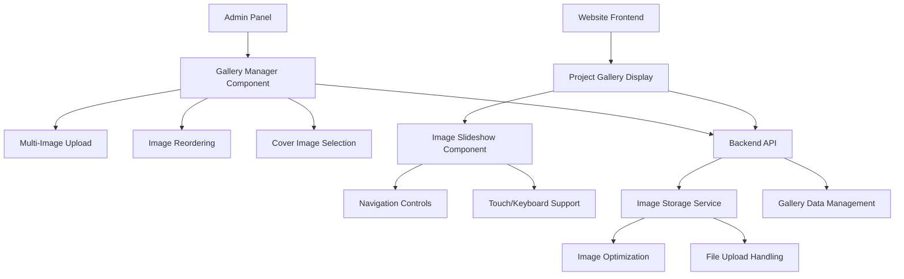

# Design Document: Project Gallery Management

## Overview

This design implements a comprehensive gallery management system for construction projects, enabling administrators to upload and manage multiple images per project while providing website visitors with an interactive slideshow experience. The solution extends the existing project management infrastructure with minimal disruption to current functionality.

## Architecture

### System Components



### Data Flow

1. **Upload Flow**: Admin uploads multiple images → Gallery Manager validates and processes → Backend stores optimized images → Database records gallery metadata
2. **Display Flow**: Website requests project → Backend returns gallery data → Slideshow component renders interactive gallery
3. **Management Flow**: Admin reorders/selects images → Gallery Manager updates → Backend persists changes → Real-time preview updates

## Components and Interfaces

### 1. MultiImageUpload Component

**Purpose**: Enhanced component supporting multiple photo uploads for comprehensive project documentation

**Key Features**:
- **Batch Upload Support**: Upload multiple photos simultaneously (up to 10-15 images per project)
- **Drag-and-Drop Interface**: Drag multiple files at once or select multiple files from file browser
- **Real-time Preview Grid**: Show thumbnails of all uploaded photos in a sortable grid
- **Progress Tracking**: Individual progress bars for each uploading image
- **Angle Documentation**: Allow admins to add captions like "Front View", "Interior", "Detail Shot"
- **Cover Photo Selection**: Designate which photo appears as the main project thumbnail

**Multiple Upload Interface**:
```typescript
interface MultiImageUploadProps {
  images: ProjectImage[];
  onChange: (images: ProjectImage[]) => void;
  maxImages?: number; // Default: 15 images per project
  coverImageId?: string;
  onCoverImageChange: (imageId: string) => void;
  allowBatchUpload: boolean; // Enable multiple file selection
  showAngleLabels?: boolean; // Allow angle/view labeling
}

interface ProjectImage {
  id: string;
  url: string;
  filename: string;
  order: number;
  isCover: boolean;
  caption?: string; // "Front View", "Side Angle", "Interior Detail"
  angle?: string; // Optional angle description
}
```

### 2. ProjectGallery Component (Website Slider)

**Purpose**: Interactive photo slider for website visitors to view projects from multiple angles

**Key Features**:
- **Multi-Photo Slider**: Display all project photos in an interactive slideshow
- **Smooth Transitions**: Fade or slide transitions between different project angles
- **Navigation Controls**: Previous/Next arrows, dot indicators showing photo count
- **Touch/Swipe Support**: Mobile-friendly swipe gestures for photo navigation
- **Auto-Play Option**: Automatic slideshow with pause on hover
- **Angle Indicators**: Show photo captions/angles if provided ("Front View", "Interior")
- **Zoom Capability**: Click to enlarge photos for detailed viewing

**Slider Interface**:
```typescript
interface ProjectGalleryProps {
  images: ProjectImage[];
  autoPlay?: boolean; // Auto-advance through photos
  autoPlayInterval?: number; // Time between slides (default: 4000ms)
  showControls?: boolean; // Show navigation arrows
  showDots?: boolean; // Show dot indicators
  showCaptions?: boolean; // Display photo captions/angles
  aspectRatio?: string; // Maintain consistent sizing
  enableZoom?: boolean; // Allow photo enlargement
}
```

### 3. GalleryManager Component (Admin Interface)

**Purpose**: Admin interface for managing multiple project photos and organizing them effectively

**Key Features**:
- **Batch Upload Interface**: Select and upload multiple photos at once (5-15 photos per project)
- **Sortable Photo Grid**: Drag-and-drop to reorder how photos appear in the slider
- **Cover Photo Selection**: Choose which photo represents the project in listings
- **Angle Labeling**: Add descriptions like "Exterior Front", "Kitchen Interior", "Bathroom Detail"
- **Bulk Operations**: Delete multiple photos, batch caption editing
- **Upload Progress**: Real-time progress for multiple simultaneous uploads
- **Preview Mode**: See how the slider will look on the website

**Admin Management Features**:
- Upload up to 15 photos per project
- Reorder photos by dragging thumbnails
- Set cover photo for project listings
- Add captions for different angles/views
- Preview slider before publishing
- Bulk delete unwanted photos

## Data Models

### Enhanced Project Schema

```typescript
interface Project {
  id: number;
  title: string;
  slug: string;
  description?: string;
  location?: string;
  category: ProjectCategory;
  status: ProjectStatus;
  coverImage?: string; // Deprecated but maintained for compatibility
  coverImageId?: string; // New: References gallery image
  client?: string;
  area?: number;
  featured: boolean;
  gallery?: ProjectGallery;
  createdAt: Date;
  updatedAt: Date;
}

interface ProjectGallery {
  id: number;
  projectId: number;
  images: ProjectImage[];
  createdAt: Date;
  updatedAt: Date;
}

interface ProjectImage {
  id: string;
  galleryId: number;
  url: string;
  filename: string;
  order: number;
  isCover: boolean;
  alt?: string;
  caption?: string;
  createdAt: Date;
}
```

### Database Schema Changes

```sql
-- New gallery table
CREATE TABLE project_galleries (
  id SERIAL PRIMARY KEY,
  project_id INTEGER REFERENCES projects(id) ON DELETE CASCADE,
  created_at TIMESTAMP DEFAULT NOW(),
  updated_at TIMESTAMP DEFAULT NOW()
);

-- New images table
CREATE TABLE project_images (
  id UUID PRIMARY KEY DEFAULT gen_random_uuid(),
  gallery_id INTEGER REFERENCES project_galleries(id) ON DELETE CASCADE,
  url TEXT NOT NULL,
  filename TEXT NOT NULL,
  order_index INTEGER NOT NULL DEFAULT 0,
  is_cover BOOLEAN DEFAULT FALSE,
  alt_text TEXT,
  caption TEXT,
  created_at TIMESTAMP DEFAULT NOW()
);

-- Add gallery reference to projects
ALTER TABLE projects ADD COLUMN cover_image_id UUID REFERENCES project_images(id);
```

## Implementation Strategy

### Phase 1: Multiple Photo Upload Backend
1. **Database Schema**: Create tables for project galleries and multiple images
2. **Batch Upload API**: Handle multiple file uploads simultaneously
3. **Image Processing**: Optimize and resize multiple photos for web display
4. **Storage Management**: Organize multiple photos per project efficiently

### Phase 2: Admin Multi-Upload Interface
1. **MultiImageUpload Component**: Create interface for selecting multiple files
2. **Batch Upload Progress**: Show progress for multiple simultaneous uploads
3. **Photo Grid Manager**: Sortable grid for reordering multiple photos
4. **Cover Photo Selection**: Interface to choose main project thumbnail

### Phase 3: Website Photo Slider
1. **ProjectGallery Slider**: Interactive slideshow for multiple project photos
2. **Navigation Controls**: Previous/Next arrows, dot indicators, photo counter
3. **Touch/Swipe Support**: Mobile-friendly navigation between photos
4. **Auto-Play Feature**: Automatic slideshow with pause controls

### Phase 4: Enhanced Features & Testing
1. **Photo Captions**: Add angle/view descriptions to photos
2. **Zoom Functionality**: Allow visitors to enlarge photos for details
3. **Performance Optimization**: Lazy loading for multiple photos
4. **Comprehensive Testing**: Test with projects having 10-15 photos

## API Endpoints

### Gallery Management
```typescript
// Get project gallery
GET /api/projects/{id}/gallery
Response: ProjectGallery

// Upload images to gallery
POST /api/projects/{id}/gallery/images
Body: FormData with multiple files
Response: ProjectImage[]

// Reorder gallery images
PUT /api/projects/{id}/gallery/reorder
Body: { imageIds: string[] }
Response: ProjectGallery

// Set cover image
PUT /api/projects/{id}/gallery/cover
Body: { imageId: string }
Response: ProjectGallery

// Delete gallery image
DELETE /api/projects/{id}/gallery/images/{imageId}
Response: { success: boolean }
```

## Correctness Properties

*A property is a characteristic or behavior that should hold true across all valid executions of a system-essentially, a formal statement about what the system should do. Properties serve as the bridge between human-readable specifications and machine-verifiable correctness guarantees.*

### Property Reflection

After analyzing all acceptance criteria, several properties can be consolidated to avoid redundancy:
- Image ordering properties (1.2, 2.2, 2.4) can be combined into a comprehensive sequence integrity property
- UI display properties (2.1, 3.1, 3.2) can be consolidated into gallery display consistency
- Navigation properties (3.3, 3.4, 3.5, 4.1) can be unified under interaction behavior
- Backward compatibility properties (6.1, 6.3, 6.4) can be merged into compatibility preservation

### Core Properties

Property 1: Gallery sequence integrity
*For any* project gallery, when images are added, reordered, or deleted, the remaining images should maintain a consistent sequential order without gaps or duplicates
**Validates: Requirements 1.2, 2.2, 2.4**

Property 2: Image validation consistency
*For any* file upload attempt, the system should validate file type and size constraints and reject invalid files while accepting valid ones
**Validates: Requirements 1.3**

Property 3: Cover image designation
*For any* project gallery, exactly one image should be designated as the cover image, defaulting to the first image if none is explicitly selected
**Validates: Requirements 2.3, 2.5**

Property 4: Gallery display completeness
*For any* project with multiple images, the slideshow should display navigation controls and image indicators appropriate to the image count
**Validates: Requirements 3.2, 4.3**

Property 5: Navigation interaction consistency
*For any* slideshow navigation action (click, keyboard, touch), the system should transition to the correct next or previous image
**Validates: Requirements 3.3, 3.5, 4.1**

Property 6: Responsive layout preservation
*For any* screen size change, the gallery should maintain proper aspect ratios and display proportions
**Validates: Requirements 4.2**

Property 7: Data integrity maintenance
*For any* gallery operation, the system should preserve referential integrity between projects and their associated images
**Validates: Requirements 5.3**

Property 8: Cascading deletion completeness
*For any* project deletion, all associated gallery images should be removed from both database and storage
**Validates: Requirements 5.4**

Property 9: Upload method equivalence
*For any* valid image, both file upload and URL-based addition should result in the same gallery state
**Validates: Requirements 5.5**

Property 10: Backward compatibility preservation
*For any* existing project, the gallery system should display the project correctly whether it has legacy single images or new gallery data
**Validates: Requirements 6.1, 6.2, 6.3**

<function_calls>
<invoke name="prework">
<parameter name="featureName">project-gallery-management

## Error Handling

### Upload Error Scenarios
- **File Type Validation**: Reject non-image files with clear error messages
- **File Size Limits**: Prevent uploads exceeding size constraints with progress feedback
- **Network Failures**: Implement retry mechanisms with exponential backoff
- **Storage Quota**: Handle storage limits gracefully with user notification

### Gallery Management Errors
- **Concurrent Modifications**: Handle simultaneous admin edits with conflict resolution
- **Missing Images**: Gracefully handle broken image URLs with fallback placeholders
- **Database Constraints**: Prevent orphaned gallery records with proper transaction handling
- **Permission Errors**: Validate admin permissions before allowing gallery modifications

### Display Error Handling
- **Image Loading Failures**: Show placeholder images for failed loads
- **Navigation Errors**: Prevent navigation beyond gallery bounds
- **Responsive Breakpoints**: Handle edge cases in responsive design transitions
- **Accessibility Fallbacks**: Provide alternative navigation when JavaScript is disabled

## Testing Strategy

### Dual Testing Approach
The system will use both unit tests and property-based tests for comprehensive coverage:

**Unit Tests** focus on:
- Specific upload scenarios and edge cases
- Individual component behavior verification
- API endpoint response validation
- Database migration correctness

**Property-Based Tests** focus on:
- Gallery sequence integrity across all operations
- Image validation consistency with random inputs
- Navigation behavior across all interaction types
- Responsive design behavior across screen sizes

### Property Test Configuration
- Minimum 100 iterations per property test
- Each property test references its design document property
- Tag format: **Feature: project-gallery-management, Property {number}: {property_text}**

### Test Coverage Areas
1. **Gallery CRUD Operations**: Create, read, update, delete galleries
2. **Image Upload Workflows**: Single and batch upload scenarios
3. **Reordering Functionality**: Drag-and-drop and programmatic reordering
4. **Slideshow Interactions**: Navigation, keyboard, and touch controls
5. **Responsive Behavior**: Cross-device and cross-browser compatibility
6. **Performance Metrics**: Load times, image optimization, lazy loading
7. **Backward Compatibility**: Legacy project display and migration

### Integration Testing
- End-to-end admin workflows from upload to display
- Cross-browser slideshow functionality
- Mobile device touch interaction testing
- Performance testing with large image galleries
- Database migration testing with existing project data